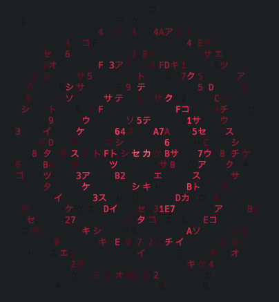

<div align="center">

  

Spin up vulnerable targets from your terminal 🎯

[](https://go.dev/)
[](LICENSE)
[](https://github.com/HappyHackingSpace/vt/releases)
[](https://discord.happyhacking.space)

</div>

> [!CAUTION]
> **This project is in active development.** Expect breaking changes with releases. Review the [release changelog](https://github.com/HappyHackingSpace/vt/releases) before updating. **vt** creates intentionally vulnerable environments - always run in isolated networks (VMs/sandboxes) and never expose to the internet.

---

## Table of Contents

- [Features](#features)
- [Installation](#installation)
- [Quick Start](#quick-start)
- [Usage](#usage)
- [Templates](#templates)
- [What can you do with vt?](#what-can-you-do-with-vt)
- [Documentation](#documentation)
- [Star History](#star-history)
- [Contributors](#contributors)
- [Community](#community)
- [License](#license)

---

## Features

| | Feature | Description |
|:--:|---------|-------------|
| 🐳 | **Docker Compose** | Container orchestration for vulnerable environments |
| 📦 | **Templates** | Community-curated vulnerable targets from [vt-templates](https://github.com/HappyHackingSpace/vt-templates) |
| 📊 | **State Tracking** | Track and manage running deployments |
| 🔄 | **Auto-Update** | Sync templates from remote repository |

---

## Installation

### Prerequisites

- Go 1.24+
- Docker & Docker Compose

### Install with Go

```bash
go install github.com/happyhackingspace/vt/cmd/vt@latest
```

### Build from Source

```bash
git clone https://github.com/HappyHackingSpace/vt.git
cd vt
go build -o vt cmd/vt/main.go
mv vt /usr/local/bin/  # Optional: add to PATH
```

---

## Quick Start

```bash
# 1. Browse available templates
vt template --list

# 2. Start a vulnerable environment
vt start --id vt-dvwa

# 3. Access the target at http://localhost:80
```

---

## Usage

<details>
<summary><b>Command Reference</b></summary>

| Command | Description |
|---------|-------------|
| `vt template --list` | List all available templates |
| `vt template --list --filter <tag>` | Filter templates by tag |
| `vt template --update` | Update templates from remote repository |
| `vt start --id <template-id>` | Start a vulnerable environment |
| `vt ps` | List running environments |
| `vt stop --id <template-id>` | Stop an environment |
| `vt -v debug <command>` | Run with debug verbosity |

</details>

### Examples

```bash
# List templates with SQL injection vulnerabilities
vt template --list --filter sqli

# Start DVWA (Damn Vulnerable Web App)
vt start --id vt-dvwa

# Check running environments
vt ps

# Stop a specific environment
vt stop --id vt-dvwa
```

---

## Templates

Templates are automatically cloned to `~/vt-templates` on first run.

| Template | Type | Description |
|----------|:----:|-------------|
| `vt-dvwa` | Lab | Damn Vulnerable Web Application |
| `vt-juice-shop` | Lab | OWASP Juice Shop |
| `vt-webgoat` | Lab | OWASP WebGoat |
| `vt-bwapp` | Lab | Buggy Web Application |
| `vt-mutillidae-ii` | Lab | OWASP Mutillidae II |

> **Want more?** Check out the [vt-templates repository](https://github.com/HappyHackingSpace/vt-templates) for all available templates and contribution guidelines.

---

## What can you do with vt?

| Use Case | Template |
|----------|----------|
| Practice SQL Injection | [vt-dvwa](https://github.com/HappyHackingSpace/vt-templates/tree/main/labs/vt-dvwa) |
| Learn XSS Exploitation | [vt-dvwa](https://github.com/HappyHackingSpace/vt-templates/tree/main/labs/vt-dvwa) |
| Test OWASP Top 10 | [vt-juice-shop](https://github.com/HappyHackingSpace/vt-templates/tree/main/labs/vt-juice-shop) |
| Exploit Real CVEs | [vt-2025-29927](https://github.com/HappyHackingSpace/vt-templates/tree/main/cves/vt-2025-29927) |
| API Security Testing | [vt-webgoat](https://github.com/HappyHackingSpace/vt-templates/tree/main/labs/vt-webgoat) |
| Train Security Teams | [vt-mutillidae-ii](https://github.com/HappyHackingSpace/vt-templates/tree/main/labs/vt-mutillidae-ii) |

---

## Documentation

| | Resource | Description |
|:--:|----------|-------------|
| 📦 | [Templates](https://github.com/HappyHackingSpace/vt-templates) | Browse all available templates |
| 🤝 | [Contributing](./CONTRIBUTING.md) | Contribution guidelines |
| 🐛 | [Issues](https://github.com/HappyHackingSpace/vt/issues) | Report bugs or request features |

---

## Star History

<a href="https://star-history.com/#HappyHackingSpace/vt&Date">
  <picture>
    <source media="(prefers-color-scheme: dark)" srcset="https://api.star-history.com/svg?repos=HappyHackingSpace/vt&type=Date&theme=dark" />
    <source media="(prefers-color-scheme: light)" srcset="https://api.star-history.com/svg?repos=HappyHackingSpace/vt&type=Date" />
    
  </picture>
</a>

---

## Contributors

<!-- readme: collaborators,contributors -start -->
<table>
	<tbody>
		<tr>
            <td align="center">
                <a href="https://github.com/recepgunes1">
                    
                    <br />
                    <sub><b>Recep Gunes</b></sub>
                </a>
            </td>
            <td align="center">
                <a href="https://github.com/dogancanbakir">
                    
                    <br />
                    <sub><b>Dogan Can Bakir</b></sub>
                </a>
            </td>
            <td align="center">
                <a href="https://github.com/omarkurt">
                    
                    <br />
                    <sub><b>Omar Kurt</b></sub>
                </a>
            </td>
            <td align="center">
                <a href="https://github.com/ahsentekd">
                    
                    <br />
                    <sub><b>Ahsen</b></sub>
                </a>
            </td>
            <td align="center">
                <a href="https://github.com/atiilla">
                    
                    <br />
                    <sub><b>Atilla</b></sub>
                </a>
            </td>
            <td align="center">
                <a href="https://github.com/mirackayikci">
                    
                    <br />
                    <sub><b>mirackayikci</b></sub>
                </a>
            </td>
		</tr>
		<tr>
            <td align="center">
                <a href="https://github.com/numanturle">
                    
                    <br />
                    <sub><b>numan</b></sub>
                </a>
            </td>
		</tr>
	<tbody>
</table>
<!-- readme: collaborators,contributors -end -->

---

## Community

- 💬 **Discord**: [Join our community](https://discord.happyhacking.space)
- 🐛 **Issues**: [Report bugs](https://github.com/HappyHackingSpace/vt/issues)
- 🤝 **Contributing**: Check out [CONTRIBUTING.md](./CONTRIBUTING.md)

---

## License

This project is licensed under the MIT License - see the [LICENSE.md](./LICENSE.md) file for details.

---

<div align="center">

**Happy Hacking!** 🎯

</div>
